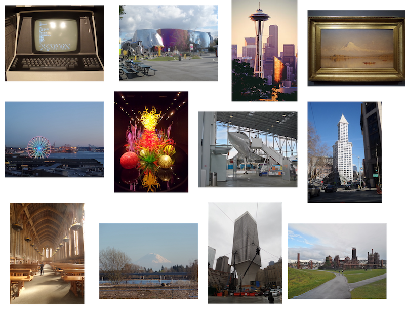
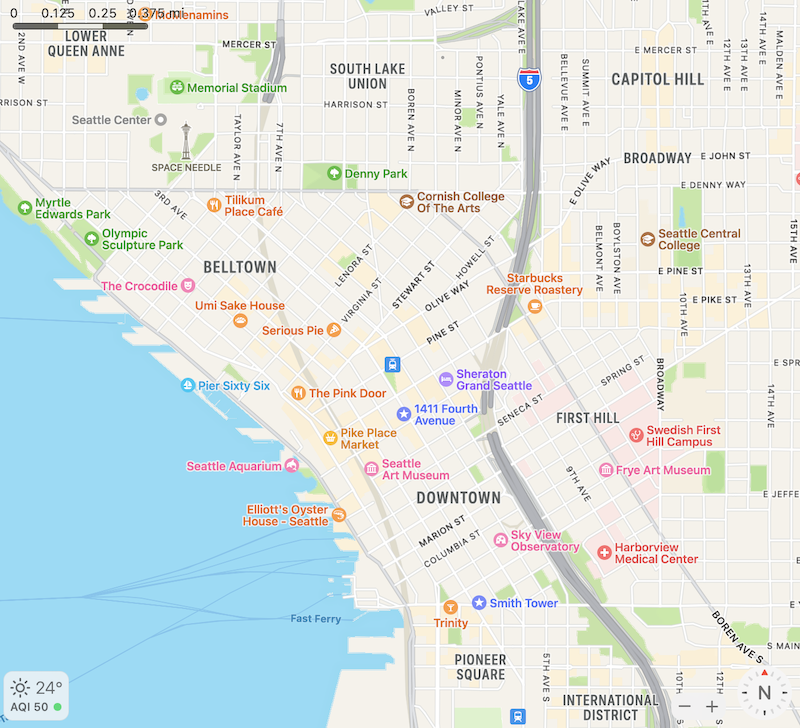

```{r, include = FALSE}
knitr::opts_chunk$set(
  collapse = TRUE,
  comment = "#>",
  echo = FALSE, message = FALSE, dpi = 72, fig.align = "center"
)
```

```{r}
library(urbnmapr)
library(ggplot2)
library(sf)
```

# An analogy from geographical space
Data from bulk RNA-seq, single cell RNA-seq (scRNA-seq), and spatial transcriptomics all come from originally spatially organized tissues (except for blood), where such spatial organization plays a role in the properties and functions of the tissues. For this reason, a geographical analogy may be more adequate than the traditional analogy of the smoothie vs. fruit salad vs. tart. 

Many of you attending this conference in person have traveled to Seattle, and might explore Seattle after the talks or the entire conference. Bulk RNA-seq is like average values over the entire Washington state. It gives some information, such as that on average, Washington tends to have fewer sunny days per year than California. However, each state has diverse climate and weather, and the tourist prepares for weather in individual cities rather than the state average.

```{r}
data("statedata")
```

```{r}
states_sf <- get_urbn_map("states", sf = TRUE)
states_sf <- st_transform(states_sf, crs = 4326)
```

```{r}
states_sub <- states_sf[states_sf$state_name %in% c("California", "Oregon", "Washington", "Nevada"),]
bboxes <- lapply(states_sub$geometry, st_bbox)
# From bestplaces.net
states_sub$sunny_days <- c(252, 258, 175, 165)
for (i in seq_along(bboxes)) {
  states_sub$geometry[i] <- states_sub$geometry[i] - bboxes[[i]][c("xmin", "ymin")]
}
```

```{r, fig.width=8, fig.height=3, fig.alt="Maps of California, Nevada, Oregon, and Washington shown in separate facets and dissociated from space, each colored by the average number of sunny days per year in the state. California and Nevada have more sunny days than Oregon and Washington."}
ggplot(states_sub, aes(fill = sunny_days)) + geom_sf() +
  theme_void(18) +
  facet_wrap(~ state_name, nrow = 1) +
  labs(title = "Average number of sunny days per year")
```

Non-spatial scRNA-seq is like a list of tourist attractions in Seattle without spatial locations, where each tourist attraction is analogous to a cell. There's the Space Needle, the Museum of Pop Culture, Chihuly Garden and Glass, Smith Tower, Pike Place, Museum of Flight, and etc. These tourist attractions can also be classified based on their characteristics, such as architectural style, function, and era of construction, analogous to gene expression. Dimension reduction can be performed on these numerous characteristics. Compared to the state averages, this would be of more interest to a tourist. 

```{r, fig.align='center', fig.alt="Photos of tourist attractions in Seattle dissociated from the geographical locations of these tourist attractions. The tourist attractions include: Living Computers, Museum of Pop Culture, Space Needle, Seattle Museum of Art, Pike Place, Chihuly Glass and Garden, Museum of Flight, Smith Tower, University of Washington, Mount Rainier, and Gas Works Park."}

```

How to get to these tourist attractions? When you look at the map, you find that certain kinds of tourist attractions tend to cluster in space, such as the cluster of museums in the vicinity of Space Needle and the cluster of older buildings around Smith Tower. Different regions of Seattle with different vibes and functions are also annotated on the map. There are historical reasons that led to such spatial regions and clustering, such as the 1962 World's Fair that gave rise to the Space Needle. Here we see how locating the tourist attractions in space point to a deeper understanding of the properties of Seattle. Spatial transcriptomics is like studying a map of Seattle. 

```{r, fig.align='center', fig.width=5, fig.height=5, fig.alt="A map of central Seattle with places of interest and neighborhoods labeled."}

```

# Introduction to spatial transcriptomics data
Spatial transcriptomics helps us to make maps of the tissue, so just like in the geographical map, we may locate characteristics of cells in space and find spatial neighborhoods of cells. A working definition of "spatial transcriptomics" is any attempt to quantify the transcripts of more genes than can be done in one round of fluorescent *in situ* hybridization (FISH) while preserving the spatial context of the gene expression in the tissue. Since 2018, interest in spatial transcriptomics -- in both data collection and data analysis -- has grown drastically. 
```{r, fig.cap="Number of publication over time for current era data collection and data analysis. Bin width is 120 days. The x-shaped points show the number of publications from the last bin, which is not yet full.", fig.alt="Number of publications on spatial transcriptomics over time are shown as curves. The x axis is date published, and the y axis is number of publication in each 120 day time bin. The blue curve is for data collection papers, and the y axis is for data analysis papers. Both curves rise sharply since 2018."}
knitr::include_graphics("analysis-current-1.png", dpi = 200)
```

Based on how the spatial context is preserved, spatial transcriptomics data collection technologies fall into 5 categories, sorted by popularity (plot showing number of publications per category), though there are gray areas:

```{r, fig.cap="Techniques used by at least 3 institutions and the number of institutions that have used them.", fig.alt="Bar chart showing the number of institutions using each spatial transcriptomics data collection method. Only methods used by at least 3 different institutions are shown. The bars are colored by category of the methods. 10X Visium (category NGS barcoding) is used by over 100 institutions, far more than any other method. Following Visium is GeoMX DSP (category ROI selection), used by over 20 institutions. 2016 ST and some other ROI selection methods follow, then ISS, then Stereo-seq and slide-seq2 (both NGS barcoding), then a number of smFISH based methods such as Molecular Cartography and MERFISH."}
knitr::include_graphics("n-insts-1.png", dpi = 200)
```

1. Next generation sequencing (NGS) with spatial barcoding, where spatial locations of the barcodes are known, such as 10X Visium, Slide-seq, and Stereo-seq. Many of these methods, such as the popular Visium, do not have single cell resolution. Hence cell type deconvolution is commonly performed.
2. Region of interest (ROI) selection, where the act of specifying the ROIs itself defines the spatial locations, such as laser capture microdissection (LCM) followed by NGS and GeoMX DSP, where UV light is used to cleave probes only in the selected ROIs for quantification. The ROIs can also be sections in one spatial dimension, such as in Tomo-seq. These methods also generally don't have single cell resolution.
3. Single molecular FISH, where each detected transcript can be seen as a discrete puncta and counted, such as MERFISH, seqFISH, and Molecular Cartography. Combinatorial barcoding over multiple rounds -- where fluorescent probes are hybridized to the transcripts or cDNAs and color or presence or absence of the probes are recorded and genes are identify by the sequence of colors or presence/absence -- is used to quantify more genes than easily discernible colors simultaneously. Datasets from highly multiplexed smFISH are usually not genome wide, and only quantify a few hundred genes at a time, though these technologies have been used in an increasing number of cells per experiment.
4. *In situ* sequencing (ISS), which is similar to smFISH as the transcripts are visualized as discrete puncta and counted. However, in ISS, the gene barcodes are determined by *in situ* sequencing, usually with sequencing by ligation, rather than with combinatorial barcoding. smFISH and ISS based data have single cell resolution.
5. Spatial context is not directly recorded, but computationally reconstructed, such as by recording pairwise spatial adjacency of cDNAs as in DNA microscopy. In addition, the term "spatial" is sometimes used to refer to sub-cellular resolution, such as in APEX-seq, where transcripts are "localized" or organelles; since no spatial coordinates are recorded, packages in this workshop are irrelevant to these technologies.

```{r, dpi = 300, fig.alt="Schematics of key aspects of some spatial transcriptomics data collection technologies of interest. Panel A: Infrared (IR) laser capture microdissection, where IR laser melts a membrane to fuse it to the tissue in order to microdissect that region of the tissue. Panel B: GeoMX DSP targets each gene with probes with ultraviolet (UV) cleavable tags to identify the genes; the UV laser is directed at certain ROIs to only quantify gene expression from these ROIs. Panel C: In seqFISH, a smFISH based method, genes from which each transcript spot comes from are identified by a sequence of colors from different rounds of hybridization. Panel D: In MERFISH, another smFISH based method, a binary code of presence and absence of signal from each transcript spot over multiple rounds of hybridization is used to identify the gene each transcript spot comes from. Panel E: A method of sequencing by ligation called cPAL is commonly used in ISS. The gene barcodes are rolling circle amplified. Each round of hybridization queries one base in the barcode, and the base is read off as a color. Only probes matching at the queried base can be ligated to another probe with known sequence, and those not ligated are washed away before reading off the bases. Panel F: Schematics of different NGS barcoding technologies. Of interest here, Visium prints spatial barcodes with transcript capture sequences on a glass slide in a hexagonal array. Each spot is 55 microns in diameter and 100 microns apart center to center. The tissue is mounted on the slide and permeablized so the spots capture the transcripts from the tissue. Panel G: Schematics of upstream and downstream data analyses in spatial transcriptomics; this panel is described in the following paragraph in the main text."}
knitr::include_graphics("https://media.springernature.com/full/springer-static/image/art%3A10.1038%2Fs41592-022-01409-2/MediaObjects/41592_2022_1409_Fig2_HTML.png")
```

Data analysis methods written for spatial transcriptomics can be broadly categorized as upstream and downtream. In upstream analysis, the raw data is converted into more usable forms, such as getting the gene count matrix from fastq files and cell type deconvolution of Visium spots. Downstream analysis begins with the more usable form of data for further biological inferences, such as finding spatially variable genes, spatial regions informed by gene expression, and cell-cell interactions. `SpatialFeatureExperiment`, as a way to represent data, is more upstream, while `Voyager`, for exploratory spatial data analysis (ESDA), is a little more downstream.

In the literature when spatial transcriptomics data is generated, the data is often treated as non-spatial scRNA-seq data, and some data analysis methods for spatial transcriptomics data do not take the spatial information into account and are sometimes aimed at non-spatial data as well. For example, most cell type deconvolution methods don't take into account spatial autocorrelation in cell type distribution, and deconvolution methods for bulk RNA-seq is sometimes used for Visium data. However, the spatial information presents many opportunities unavailable to scRNA-seq, and this workshop will explore some of these opportunities. Among the opporunities are:

1. Identifying spatial regions characterized by gene expression of cell types, just like neighborhoods in geographical space. Many methods have been written for this purpose.
2. Tissue and cellular morphology is available along side transcriptomics, and may be related to gene expression. This is explored a little in this workshop.
3. Explore how gene expression and quality control (QC) metrics vary in space, such as strength, length scale, and direction (anisotropy) of spatial autocorrelation. This workshop explores strength and length scale of spatial autocorrelation; anisotropy will be supported in a later version of the `Voyager` package.

# Geospatial data types and how they may relate to spatial transcriptomics
Opportunities presented by spatial data can be explored by leveraging a vast tradition of tools made for geospatial data. Geospatial data broadly fall into two types by representation: vector and raster. Vector data represents the world as points, lines, and polygons, specified by coordinates. For example, polygons would be specified by coordinates of the vertices. Raster data are basically images, where each pixel has a value, though unlike the typical RGB image, raster data can have many different layers analogous to the 3 channels in RGB images. Raster is common in remote sensing.
```{r, fig.alt="Example image of different types of geospatial data: Areal, showing covid cases per capita as of July 12, 2022 in Seattle. Geostatistical, showing zinc concentration measured at many points around the Meuse river. Network, showing Strava heatmap of road popularity among cyclists in Seattle. Point process, showing locations of copper mines and geological faults. Raster, showing an elevation map in Zion National Park. These data types are explained in the main text."}
knitr::include_graphics("spatial_types.png")
```

Vector data can be further classified by the processes generating the data:

1. Areal, where values are for entire areas (e.g. cities, zip codes) rather than individuals. This is common in epidemiology to protect patients' privacy. 
2. Geostatistical, where a spatial process (e.g. Gaussian process) is sampled at points in space, and the locations of those points are known and not of interest by themselves. Rather, the values are of interest. An example is measurements of pollutant concentration at points in space.
3. Point process, where the locations of occurrence is of interest, such as where individuals of a species of plants occur. The locations themselves are analyzed to find if they are randomly distributed, clustered, or repelling each other, and if they are affected by covariates.
4. When a phenomenon can only occur on a spatial network, such as roads and rivers. This can be a point process, such as locations of traffic incidents. This can also be analogous to raster data, such as [Strava's road/trail popularity heatmap](https://www.strava.com/heatmap), or areal when Strava's heatmap is summarized over segments. 

For each of these data types, there are already well-established tools for data analysis. For example, `sf` represents vector data and makes it behave like a data frame in R, `spdep` can be used for spatial dependency of areal data, `INLA` can be used for Bayesian spatial modeling, `gstat` is used for interpolation with geostatistical data (kriging), `spatstat` is used for point process data, `sfnetworks` for network data, and `spatstat` supports point process analysis within a network. 

If we can relate these data types to spatial transcriptomics, then we can take advantage of these data analysis tools:

1. Visium, LCM, and GeoMX DSP data aggregate transcript counts over areas. In addition, in smFISH and ISS data, the counts are also often aggregated over cells, and the cells are represented as polygons in space. Here such data is analogous the areal data, although unlike for cities and zip codes, the polygons may not be contiguous most of the time.
2. If gene expression, or gene expression program, are imaged as spatial processes, and the cells or Visium spots are imagined as points, ignoring their area, then the data is analogous to geostatistical data. (Shall I mention that R package using kriging)
3. Locations of transcript spots in smFISH and ISS based data, and locations of cells and cell types can be thought of as spatial point processes.
4. Spatial networks seem less relevant to spatial transcriptomics. One potential use case is blood vessels. However, since spatial transcriptomics data is usually obtained from thin sections of the original 3D tissue, very little of the original 3D blood vessel network remains in the section. 
5. With the regular grids, Visium and 2016 Spatial Transcriptomics data may be seen as a low resolution raster.

Some geospatial data analysis methods have already been used in spatial transcriptomics, such as Gaussian process regression (which kriging is based on), Potts model, spatial point process analyses, conditional autoregressive models, and global and local variants of Moran's I. (get the references) However, these sptial transcriptomics packages and data analysis in the literature don't fully explore the opportunities given by the spatial information mentioned above, nor do they always take advantage of the existing software infrastructure originally built for geospatial data.

This workshop presents the packages `SpatialFeatureExperiment` and `Voyager`, which bring more of the existing vector geospatial data analysis tools to spatial transcriptomics. `SpatialFeatureExperiment` (SFE) implements a new S4 class extending `SpatialExperiment` with `sf` data frames representing cell or Visium spot polygons, geometries of other objects, anatomical regions, and tissue boundaries, and spatial neighborhood graphs. `Voyager` to SFE is just like `scater`, `scran`, and `scuttle` to `SingleCellExperiment`, implementing basic ESDA using well-established geospatial tools and plotting functions for geometries and ESDA results. 
With `sf`, we focus on vector areal data here, because of the popularity of Visium, and that although the fluorsecent or H&E images are raster, vector features extracted from the images, such as cell and nuclei segmentation, and transcript spots, are more commonly used for downstream analyses. 

# Limitations and future directions

No analogy is perfect, and these are some limitations of the geospatial analogy that would call for data analysis methods specific to spatial transcriptomics:

1. Biological tissues are usually originally 3D. Although most spatial transcriptomics datasets come from thin sections, some datasets come from thicker sections. However, the z dimension usually has much lower resolution than x and y if present, and might need to be treated differently. Geospatial tools and resources are very focused on 2D. If 3D support is present (e.g. 3D spatial point processes in `spatstat`), the support may be limited.
2. Spatial transcriptomics datasets can get much larger than most geospatial vector datasets, from thousands of genes and thousands to millions of cells or spots. There should be more emphasis on multivariate spatial analyses, which we plan to add to a later version of `Voyager`. On disk tools exist for geospatial data, but are not supported by SFE yet. 
3. Unlike cities and natural landscapes, development and structure of some tissues (e.g. the cerebral cortex) are tightly regulated and similar across individuals.
