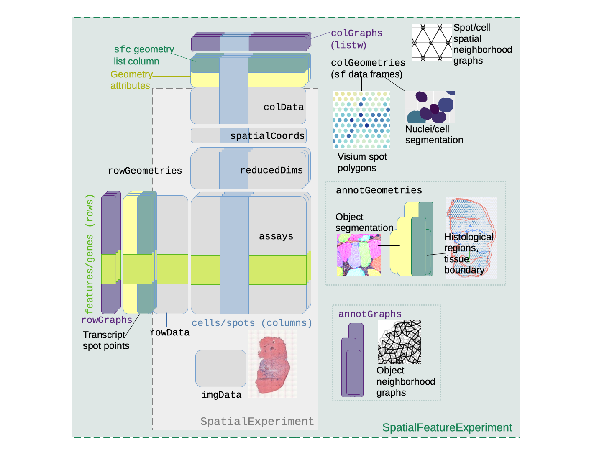

```{r, include = FALSE}
knitr::opts_chunk$set(
  collapse = TRUE,
  comment = "#>"
)
```

# Introduction
Simple Features are a standardized way to represent geometries in space. The [`sf`](https://cran.r-project.org/web/packages/sf/index.html) package provides Simple Features access to R, with the `sf` data frame, which can behave like a regular data frame but has a special list column for the geometries.

```{r, fig.cap="Schematic of the sf data frame, illustration by Allison Horst", fig.alt="A cartoon illustrating the sf data frame; in addition to a regular data frame, geometries are in a special list column. In the cartoon, furry ball characters are taping geometries onto the data frame, in that geometry list column."}
knitr::include_graphics("https://user-images.githubusercontent.com/520851/50280460-e35c1880-044c-11e9-9ed7-cc46754e49db.jpg")
```

`SpatialFeatureExperiment` (SFE) is a new [S4](http://adv-r.had.co.nz/S4.html) class built on top of [`SpatialExperiment`](https://bioconductor.org/packages/release/bioc/html/SpatialExperiment.html) (SPE). `SpatialFeatureExperiment` incorporates geometries and geometry operations with the `sf` package. Examples of supported geometries are Visium spots represented with polygons corresponding to their size, cell or nuclei segmentation polygons, tissue boundary polygons, pathologist annotation of histological regions, and transcript spots of genes. Using `sf`, `SpatialFeatureExperiment` leverages the GEOS C++ libraries underlying `sf` for geometry operations, including algorithms for for determining whether geometries intersect, finding intersection geometries, buffering geometries with margins, etc. A schematic of the SFE object is shown below:

```{r, echo=FALSE, out.width = "100%", fig.cap="Schematics of the SFE object", fig.alt="SpatialFeatureExperiment expands on SpatialExperiment by adding column, row, and annotation geometries and spatial graphs. This is explained in detail in the following paragraphs."}

```

Below is a list of SFE features that extend the SPE object:

* `colGeometries` are `sf` data frames associated with the entities that correspond to columns of the gene count matrix, such as Visium spots or cells. The geometries in the `sf` data frames can be Visium spot centroids, Visium spot polygons, or for datasets with single cell resolution, cell or nuclei segmentations. Multiple `colGeometries` can be stored in the same SFE object, such as one for cell segmentation and another for nuclei segmentation. There can be non-spatial, attribute columns in a `colGeometry` rather than `colData`, because the `sf` class allows users to specify how attributes relate to geometries, such as "constant", "aggregate", and "identity". See the `agr` argument of the [`st_sf` documentation](https://r-spatial.github.io/sf/reference/sf.html).
* `colGraphs` are spatial neighborhood graphs of cells or spots. The graphs have class `listw` (`spdep` package), and the `colPairs` of `SingleCellExperiment` was not used so no conversion is necessary to use the numerous spatial dependency functions from `spdep`, such as those for Moran's I, Geary's C, Getis-Ord Gi*, LOSH, etc. Conversion is also not needed for other classical spatial statistics packages such as `spatialreg` and `adespatial`.
* `rowGeometries` are similar to `colGeometries`, but support entities that correspond to rows of the gene count matrix, such as genes. A potential use case is to store transcript spots for each gene in smFISH or in situ sequencing based datasets.
* `rowGraphs` are similar to `colGraphs`. A potential use case may be spatial colocalization of transcripts of different genes.
* `annotGeometries` are `sf` data frames associated with the dataset but not directly with the gene count matrix, such as tissue boundaries, histological regions, cell or nuclei segmentation in Visium datasets, and etc. These geometries are stored in this object to facilitate plotting and using `sf` for operations such as to find the number of nuclei in each Visium spot and which histological regions each Visium spot intersects. Unlike `colGeometries` and `rowGeometries`, the number of rows in the `sf` data frames in `annotGeometries` is not constrained by the dimension of the gene count matrix and can be arbitrary.
* `annotGraphs` are similar to `colGraphs` and `rowGraphs`, but are for entities not directly associated with the gene count matrix, such as spatial neighborhood graphs for nuclei in Visium datasets, or other objects like myofibers. These graphs are relevant to `spdep` analyses of attributes of these geometries such as spatial autocorrelation in morphological metrics of myofibers and nuclei. With geometry operations with `sf`, these attributes and results of analyses of these attributes (e.g. spatial regions defined by the attributes) may be related back to gene expression.

```{r setup}
library(SpatialFeatureExperiment)
library(SpatialExperiment)
library(SFEData)
library(sf)
library(Matrix)
```

# Object construction
## From scratch
An SFE object can be constructed from scratch with the assay matrices, column metadata, and spatial coordinates. In this toy example, `dgCMatrix` is used, but since SFE inherits from SingleCellExperiment (SCE), other types of arrays supported by SCE such as delayed arrays should also work.
```{r}
# Visium barcode location from Space Ranger
data("visium_row_col")
coords1 <- visium_row_col[visium_row_col$col < 6 & visium_row_col$row < 6,]
coords1$row <- coords1$row * sqrt(3)

# Random toy sparse matrix
set.seed(29)
col_inds <- sample(1:13, 13)
row_inds <- sample(1:5, 13, replace = TRUE)
values <- sample(1:5, 13, replace = TRUE)
mat <- sparseMatrix(i = row_inds, j = col_inds, x = values)
colnames(mat) <- coords1$barcode
rownames(mat) <- sample(LETTERS, 5)
```

That should be sufficient to create an SPE object, and an SFE object, even though no `sf` data frame was constructed for the geometries. The constructor behaves similarly to the SPE constructor. The centroid coordinates of the Visium spots in the toy example can be converted into spot polygons with the `spotDiameter` argument. Spot diameter in pixels in full resolution image can be found in the `scalefactors_json.json` file in Space Ranger output.
```{r}
sfe3 <- SpatialFeatureExperiment(list(counts = mat), colData = coords1,
                                spatialCoordsNames = c("col", "row"),
                                spotDiameter = 0.7)
```

More geometries and spatial graphs can be added after calling the constructor.

Geometries can also be supplied in the constructor. 
```{r}
# Convert regular data frame with coordinates to sf data frame
cg <- df2sf(coords1[,c("col", "row")], c("col", "row"), spotDiameter = 0.7)
rownames(cg) <- colnames(mat)
sfe3 <- SpatialFeatureExperiment(list(counts = mat), colGeometries = list(foo = cg))
```

## Space Ranger output
Space Ranger output can be read in a similar manner as in `SpatialExperiment`; the returned SFE object has the `spotPoly` column geometry for the spot polygons. If the filtered matrix is read in, then a column graph called `visium` will also be present, for the spatial neighborhood graph of the Visium spots on tissue. The graph is not computed if all spots are read in regardless of whether they are on tissue.

```{r}
# Example from SpatialExperiment
dir <- system.file(
  file.path("extdata", "10xVisium"), 
  package = "SpatialExperiment")
  
sample_ids <- c("section1", "section2")
samples <- file.path(dir, sample_ids, "outs")

# The "outs" directory in Space Ranger output
list.files(samples[1])

# The contents of the "spatial" directory
list.files(file.path(samples[1], "spatial"))

# Where the raw gene count matrix is located
file.path(samples[1], "raw_feature_bc_matrix")
```

```{r}
(sfe3 <- read10xVisiumSFE(samples, sample_ids, type = "sparse", data = "raw",
                         load = FALSE))
```

## Coercion from `SpatialExperiment`
SPE objects can be coerced into SFE objects. If column geometries or spot diameter are not specified, then a column geometry called "centroids" will be created.
```{r}
spe <- read10xVisium(samples, sample_ids, type = "sparse", data = "raw", 
  images = "lowres", load = FALSE)
```

For the coercion, column names must not be duplicate.
```{r}
colnames(spe) <- make.unique(colnames(spe), sep = "-")
rownames(spatialCoords(spe)) <- colnames(spe)
```

```{r}
(sfe3 <- toSpatialFeatureExperiment(spe))
```

# Getters and setters
```{r}
# Example dataset
(sfe <- McKellarMuscleData(dataset = "small"))
```

## Geometries
User interfaces to get or set the geometries and spatial graphs emulate those of [`reducedDims` in `SingleCellExperiment`](https://rdrr.io/bioc/SingleCellExperiment/man/reducedDims.html).

Geometries associated with columns of the gene count matrix (cells or Visium spots) can be get/set with `colGeometry`. Similarly, geometries associated with rows of the gene count matrix (genes or features) can be get/set with `rowGeometry`, and geometries associated with the annotations can be get/set with `annotGeometry`. Here we demonstrate `colGeometry` as the arguments for `rowGeometry` and `annotGeometry` are the same. See the [vignette of `SpatialFeatureExperiment`](https://pachterlab.github.io/SpatialFeatureExperiment/dev/articles/SFE.html) for more details.
```{r}
# Get Visium spot polygons
(spots <- colGeometry(sfe, type = "spotPoly"))
```

```{r, fig.alt="Hexagonal grid of Visium spots in this example dataset, plotted as polygons. Somes of the spots are cropped off at the border of this dataset."}
# Use st_geometry so it won't color by the attributes
plot(st_geometry(spots))
```

```{r}
# Setter
colGeometry(sfe, "foobar") <- spots
```

`colGeometryNames` gets or sets the names of the geometries
```{r}
(cg_names <- colGeometryNames(sfe))
```

There are shorthands for some specific geometries. For example, `spotPoly(sfe)` is equivalent to `colGeometry(sfe, "spotPoly")` for Visium spot polygons, and `txSpots(sfe)` is equivalent to `rowGeometry(sfe, "txSpots")` for transcript spots in single molecule technologies.

```{r}
# Getter
(spots <- spotPoly(sfe))
```

```{r}
# Setter
spotPoly(sfe) <- spots
```

`tissueBoundary(sfe)` is equivalent to `annotGeometry(sfe, "tissueBoundary")`.
```{r}
# Getter
(tb <- tissueBoundary(sfe))
```

```{r, fig.alt="Tissue boundary polygon of this example dataset."}
plot(st_geometry(tb))
```

```{r}
# Setter
tissueBoundary(sfe) <- tb
```

## Spatial graphs
Spatial dependence analyses in the `spdep` package requires a spatial neighborhood graph. The `SpatialFeatureExperiment` package wraps functions in the `spdep` package to find spatial neighborhood graphs. In this example, triangulation is used to find the spatial graph; many other methods are also supported, such as k nearest neighbors, distance based neighbors, and polygon contiguity.
```{r}
(g <- findSpatialNeighbors(sfe, MARGIN = 2, type = "spotPoly", method = "tri2nb"))
```

This is what the triangulated graph looks like
```{r, fig.alt="Spatial neighborhood graph of Visium spots from triangulation; some Visium spots are connected in this graph while they are not in fact adjacent in the hexagonal grid."}
plot(g, coords = spatialCoords(sfe))
```

Similar to `colGeometry`, `rowGeometry`, and `annotGeometry`, the spatial graphs can be get and set with `colGraph`, `rowGraph`, and `annotGraph`; the arguments of the graph getters and setters are the same as those of the geometry getters and setters, so we only demonstrate `colGraph` here.

For Visium, spatial neighborhood graph of the hexagonal grid can be found with the known locations of the barcodes. 
```{r}
colGraph(sfe, "visium") <- findVisiumGraph(sfe)
```

This is what the Visium graph looks like
```{r, fig.alt="Spatial neighborhood graph of Visium spots where only spots adjacent on the hexagonal grid are connected."}
plot(colGraph(sfe, "visium"), coords = spatialCoords(sfe))
```

Similar to the geometries, the graphs have getters and setters for the names:
```{r}
colGraphNames(sfe)
```

## Multiple samples
Thus far, the example dataset used only has one sample. The `SpatialExperiment` (SPE) object has a special column in `colData` called `sample_id`, so data from multiple tissue sections can coexist in the same SPE object for joint dimension reduction and clustering while keeping the spatial coordinates separate. It's important to keep spatial coordinates of different tissue sections separate because first, the coordinates would only make sense within the same section, and second, the coordinates from different sections can have overlapping numeric values. 

SFE inherits from SPE, and with geometries and spatial graphs, `sample_id` is even more important. The geometry and graph getter and setter functions shown above have a `sample_id` argument, which is optional when only one sample is present in the SFE object. This argument is mandatory if multiple samples are present, and can be a character vector for multiple samples or "all" for all samples. Below are examples of using the getters and setters for multiple samples.

```{r}
# Construct toy dataset with 2 samples
sfe1 <- McKellarMuscleData(dataset = "small")
sfe2 <- McKellarMuscleData(dataset = "small2")
spotPoly(sfe2)$sample_id <- "sample02"
(sfe_combined <- cbind(sfe1, sfe2))
```

Use the `sampleIDs` function to see the names of all samples
```{r}
sampleIDs(sfe_combined)
```

```{r}
# Only get the geometries for the second sample
(spots2 <- colGeometry(sfe_combined, "spotPoly", sample_id = "sample02"))
```

Sample IDs can also be changed, with the `changeSampleIDs` function, with a named vector whose names are the old names and values are the new names.
```{r}
sfe_combined <- changeSampleIDs(sfe_combined, replacement = c(Vis5A = "foo", sample02 = "bar"))
sampleIDs(sfe_combined)
```

# Operations
## Non-geometric
SFE objects can be concatenated with `cbind`, as was done just now to create a toy example with 2 samples.
```{r}
sfe_combined <- cbind(sfe1, sfe2)
```

The SFE object can also be subsetted like a matrix, like an SCE object. More complexity arises when it comes to the spatial graphs. The `drop` argument of the SFE method `[` determines what to do with the spatial graphs. If `drop = TRUE`, then all spatial graphs will be removed, since the graphs with nodes and edges that have been removed are no longer valid. If `drop = FALSE`, which is the default, then the spatial graphs will be reconstructed with the remaining nodes after subsetting. Reconstruction would only work when the original graphs were constructed with `findSpatialNeighbors` or `findVisiumGraph` in this package, which records the method and parameters used to construct the graphs. If reconstruction fails, then a warning will be issued and the graphs removed.
```{r}
(sfe_subset <- sfe[1:10, 1:10, drop = TRUE])
```

```{r, eval=FALSE}
# Will give warning because graph reconstruction fails
sfe_subset <- sfe[1:10, 1:10]
```

## Geometric
Just like `sf` data frames, SFE objects can be subsetted by a geometry and a predicate relating geometries. For example, if all Visium spots were read into an SFE object regardless of whether they are in tissue, and the `tissueBoundary` annotation geometry is provided, then the tissue boundary geometry can be used to subset the SFE object to obtain a new SFE object with only spots on tissue. Loupe does not give the tissue boundary polygon; such polygon can be obtained by thresholding the H&E image and converting the mask into polygons with OpenCV or the `terra` R package, or by manual annotation in QuPath or LabKit (the latter needs to be converted into polygon). 

Use the `crop` function to directly get the subsetted SFE object. Note that in this version of this package, `crop` does NOT crop the image.
```{r, fig.alt="Plot of Visium spot polygons overlaid on the tissue boundary polygon; spots not on tissue are shown."}
# Before
plot(st_geometry(tissueBoundary(sfe)))
plot(spotPoly(sfe), col = "gray", add = TRUE)
```

```{r}
sfe_in_tissue <- crop(sfe, y = tissueBoundary(sfe), colGeometryName = "spotPoly")
```

Note that for large datasets with many geometries, cropping can take a while to run.

```{r, fig.alt="Plot of Visium spot polygons overlaid on the tissue boundary polygon; only intersections between the Visium spot polygons and the tissue boundary are kept."}
# After
plot(st_geometry(tissueBoundary(sfe)))
plot(spotPoly(sfe_in_tissue), col = "gray", add = TRUE)
```

`crop` can also be used in the conventional sense of cropping, i.e. specifying a bounding box.
```{r}
sfe_cropped <- crop(sfe, colGeometryName = "spotPoly", sample_id = "Vis5A",
                    xmin = 5500, xmax = 6500, ymin = 13500, ymax = 14500)
```

The `colGeometryName` is used to determine which columns in the gene count matrix to keep. All geometries in the SFE object will be subsetted so only portions intersecting `y` or the bounding box are kept. Since the intersection operation can produce a mixture of geometry types, such as intersection of two polygons producing polygons, points, and lines, the geometry types of the `sf` data frames after subsetting may be different from those of the originals. 

The cropping is done independently for each `sample_id`, and only on `sample_id`s specified. Again, `sample_id` is optional when there is only one sample in the SFE object.

Geometry predicates and operations can also be performed to return the results without subsetting an SFE object. For example, one may want a logical vector indicating whether each Visium spot intersects the tissue, or a numeric vector of how many nuclei there are in each Visium spot. Or get the intersections between each Visium spot and nuclei. Again, the geometry predicates and operations are performed independently for each sample, and the `sample_id` argument is optional when there is only one sample.

```{r}
# Get logical vector of whether each Visium spot intersects tissue
colData(sfe)$in_tissue <- annotPred(sfe, colGeometryName = "spotPoly", 
                                    annotGeometryName = "tissueBoundary",
                                    sample_id = "Vis5A")
# Get the number of nuclei per Visium spot
colData(sfe)$n_nuclei <- annotNPred(sfe, "spotPoly", annotGeometryName = "nuclei")
# Get geometries of intersections of Visium spots and myofibers
spot_intersections <- annotOp(sfe, colGeometryName = "spotPoly", 
                              annotGeometryName = "myofiber_simplified")
```

Sometimes the spatial coordinates of different samples can take very different values. The values can be made more comparable by moving all tissues so the bottom left corner of the bounding box would be at the origin, which would facilitate plotting and comparison across samples with `geom_sf` and `facet_*`. 

To find the bounding box of all geometries in each sample of an SFE object:
```{r}
bbox(sfe, sample_id = "Vis5A")
```

To move the coordinates:
```{r}
sfe_moved <- removeEmptySpace(sfe, sample_id = "Vis5A")
bbox(sfe_moved, sample_id = "Vis5A")
```

The original bounding box before moving is stored within the SFE object, which can be read by `dimGeometry` setters so newly added geometries can have coordinates moved as well; this behavior can be turned off with the optional argument `translate = FALSE` in `dimGeometry` setters.

# Limitations
1. Only 2D data is supported for now.
2. Geometric operation do not change the SPE `ImgData`.
3. Does not support raster data or `spatstat` spatial point process analyses.

# Session info
```{r}
sessionInfo()
```
